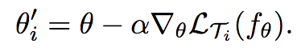
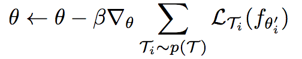

# MAML in raw numpy

This is an implementation of vanilla Model-Agnostic Meta-Learning ([MAML](https://github.com/cbfinn/maml))
in raw numpy.  I made this to better understand the algorithm and what exactly it is doing.  I derived
the forward and backward passes following conventions from [CS231n](http://cs231n.github.io/).

This code is just a rough sketch to understand the algorithm better, so it works, but 
is not optimized or well parameterized.  

This turned out to be pretty interesting and I found it helps to see the algorithm 
logic without the backprop abstracted away by an autograd package like TensorFlow.

**Table of contents**
- [Results](#results)
- [What is MAML?](#whatismaml)
- [Derivation](#derivation)


<a id="results"/>

## Results

To verify my implementation, I test on the sinusoid task from [Section 5.1](https://arxiv.org/pdf/1703.03400.pdf)
of the MAML paper.

I train for _x_ iterations on the training dataset, and then fine-tune on _x_.


These figures show comparisons between fine-tuning on 10 minibatches of 5 for MAML,
a joint-training baseline (trained on same data as MAML


These figures show MAML fine-tuning on 10 minibatches of 5, and against a baseline
that used joint training on the dataset (first plot), and against a random 
intialized network (second plot).

MAML                       |  Baseline (joint training)|  Random init
:-------------------------:|:-------------------------:|:----------:|  
  |   | 

Here are the commands to the run the code:

Run 10k iterations and then save the weights to a file: <br>
```
python3 maml.py # train the MAML and baseline (joint trained) weights
```

Fine tune the network and plot results on sine task: <br>
```
python maml.py --test 1  
```


You can also do gradient check with:

```
python maml.py --gradcheck 1  
```


You can also try maml_2layer.py.  I originally tried using a single hidden layer
because this made the derivation easier, but I found that it did not have enough
it did not have enough representational capacity to solve the sinusoid problem.
This seems to be because MAML gains power from having more layers, as described
in [Meta-Learning And Universality](https://arxiv.org/pdf/1710.11622.pdf).
This maml_2layer.py file is shorter and easier to understand, but does not produce good results.

<a id="whatismaml"/>

## What is MAML?

### Introduction

Model-Agnostic Meta-Learning is a gradient based meta-learning algorithm.  For an
overview of meta-learning, see a blog post from the author [here](https://bair.berkeley.edu/blog/2017/07/18/learning-to-learn/). 
Basically meta-learning tries to solve the problem of being able to learn 
quickly on new tasks by better incorporating past information from previous tasks.
It has some similar motivations to transfer learning, but better incentivizes for
quick adaptation, for example one-shot learning: given a single instance of, for
example, a Segway, be able to distinguish Segways from other objects in new images.

As opposed to other meta-learning techniques that use RNNs, MAML only uses feed-forward
networks and gradient descent.  The interesting thing is how it sets up the gradient
descent scheme to optimize the network for efficient fine-tuning on the meta-test set.


In the simplest case, you can think of it as doing 2 forward passes. It does:
1. Forward pass with W
1. Backward pass to compute gradients dWa
1. Apply gradients dW (using SGD: W' <-- W - alpha\*dWa)
1. Another forward pass with W'
1. Backward pass through the whole thing to compute gradients dWb (NOTE: with respect to input weights W, not W'.  This is a second order derivative)
1. Apply gradients dW' (using Adam: W <-- W - alpha\*dWb)


TODO: equation of gradient descent


In standard neural network training, we use gradient-descent and backprop.

MAML
assumes that you will use this same method to 

MAML assumes that you are going to use gradient-descent step (normal neural network training)
to fine-tune on the meta-test set, and it builds this into the training and meta optimization.

It is broken into two phases: a meta-traning phase and a fine-tuning phase.  The meta-training phase is going to work to optimize the network parameters so that the fine-tune phase works extremely well, so that the network parameters will be sensitive to gradients and can
quickly adapt to solve tasks in the distribution.

This is inspired off the great success of ImageNet fine-tuning.  But it is 
different from joint-training, and has a fine-tune step that is required, and
does a much better job at solving tasks where a joint-training solution does not correspond
to doing well on individual examples.  For instance, by always predicting 0 for a sinusoid 
regression task where phase can vary.


### Meta-training
**During meta-training**, it splits the data into A and B examples.  The A example
will be used for an inner optimization (standard gradient descent), and the B examples
will be used for an outer optimization.


TODO: something


TODO: other something



This is a second order method that requires running backpropagation twice.

**Here is some pseudocode that matches Chelsea's implementation of MAML in TensorFlow:**

```python
weights = make_NN_weights() # make weights and biases

inputA, labelA, inputB, labelB = data.meta_split()

# forward pass of network using weights and A examples
netoutA = forward(inputA, weights)
lossA = loss_func(netoutA, labelA)

gradients = get_gradients(lossA) # w.r.t. weights

fast_weights = weights + -learning_rate * gradients   # gradient descent step on weights

netoutB = forward(inputB, fast_weights)
lossB = loss_func(netoutB, labelB)

# then you would plug this lossB in an optimize like Adam to optimize
# w.r.t. to the original weights.  fast_weights are basically just a temporary
# thing to see how gradient descent on the inner lossA led to update them.
# The only state that is retained between iterations of MAML are the 
# slow weights.
```

This seems like of a stange thing to do. But basically the effect is 


You can also run more than one step.  Maybe you would run the fast weights update
multiple times.


### Fine-tuning

At the fine-tune stage, you have a set of meta-trained weights.  Now given a new task ---
say you want to train to predict new instances of samples drawn from a fixed sinusoid, given
only a few examples --- you feed examples and you fine-tune, using only the inner
gradient. You treat them like new A examples, and you keep track of the fast_weights
and you can now use those fast weights to predict new examples.

**Here is some pseudocode to illustrate how fine-tuning works and relates to training**
```
inputA, labelA = test_data

netoutA = forward(inputA, weights)
lossA = loss_func(netoutA, labelA)

gradients = get_gradients(lossA) # w.r.t. weights

fast_weights = weights + -learning_rate * gradients   # gradient descent step on weights


newInputAToPredictLabelFor = new example

prediction = forward(newInputAToPredictLabelFor, fast_weights)
```


### Notes
Beyond the scope of this paper, Chelsea Finn and colleagues have done some 
interesting further work on extending MAML and applying it to robotics problems.
Particularly, being able to use a learned loss is extremely interesting.

Check out MIL and DAML.

<a id="derivation"/>

## Derivation

The below diagram shows the meta forward pass for MAML with a single inner
updated step.  By computing the gradients through this computational graph,
I determined the computations required for the meta backwared pass. I show
the computation for a one hidden-layer neural network for simplicity, but
in the code I use a two hidden-layer neural network.

NOTE: (dW2, db2, dW1, db1) are computed in the upper figure and passed to the lower
figure. Gradients are taken w.r.t. weights that are inputs to upper figure.

**First (inner) forward and backward:**


**Inner gradient (SGD) update and second forward pass:**


